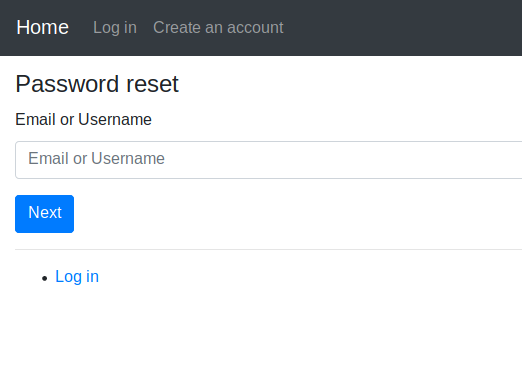

# Simple Django Login and Registration

An example of Django project with basic user functionality.

## Screenshots

| Log In | Create an account | Authorized page |
| -------|--------------|-----------------|
|  |  |  |

| Password reset | Set new password | Password change |
| ---------------|------------------|-----------------|
|  |  |  |

## Functionality

- Log in
    - via username & password
    - via email & password
    - via email or username & password
    - with a remember me checkbox (optional)
- Create an account
- Log out
- Profile activation via email
- Reset password
- Remind a username
- Resend an activation code
- Change password
- Change email
- Change profile
- Multilingual: English, French, Russian, Simplified Chinese and Spanish

If you need dynamic URLs with the language code, check out https://github.com/egorsmkv/simple-django-login-and-register-dynamic-lang

## Installing

### Clone the project

```bash
git clone https://github.com/egorsmkv/simple-django-login-and-register
cd simple-django-login-and-register
```

### Install dependencies & activate virtualenv

```bash
pip install poetry

poetry install
poetry shell
```

### Configure the settings (connection to the database, connection to an SMTP server, and other options)

1. Edit `source/app/conf/development/settings.py` if you want to develop the project.

2. Edit `source/app/conf/production/settings.py` if you want to run the project in production.

### Apply migrations

```bash
python source/manage.py migrate
```

### Collect static files (only on a production server)

```bash
python source/manage.py collectstatic
```

### Running

#### A development server

Just run this command:

```bash
python source/manage.py runserver
```

PROJECT STRUCTURE:

1.config: This app will contain the main settings and configurations of the project, such as settings.py, urls.py, and wsgi.py.

2. websites: This app will handle the CRUD operations related to the websites. It will include models such as Site, WebsiteHistory, Location, etc. The views will handle the requests related to adding, updating, and deleting sites, as well as requesting and displaying scan results.

3. accounts: This app will handle user authentication and authorization. It will include models such as User, Group, and Permission. The views will handle user registration, login, and logout, as well as managing user accounts and permissions.

4. dashboard: This app will provide the dashboard views for each type of user. It will include views such as UnauthenticatedDashboard, AdministratorDashboard, and AuditorDashboard. Each dashboard will display different information based on the user type, such as the status of all sites for unauthenticated users, and the status of the administrator's own sites for administrators.

5. api: This app will provide the API views for the project, allowing external services to access and interact with the project data. It will include views such as SiteListAPIView and ScanResultCreateAPIView.


Autorizareweb/
|-- config/ # Main configuration and setting for app,
|   |-- __init__.py
|   |-- settings.py
|   |-- urls.py
|   |-- wsgi.py
|-- websites/ # CRUD websites operations, scans, status updates, etc.
|   |-- __init__.py
|   |-- admin.py
|   |-- apps.py
|   |-- models.py
|   |-- views.py
|   |-- urls.py
|-- accounts/ # Define user roles, authentification, permissions, etc.
|   |-- __init__.py
|   |-- admin.py
|   |-- apps.py
|   |-- models.py
|   |-- views.py
|   |-- urls.py
|-- dashboard/ # Views and dashboards for different type of users( auditors, admins, normal users)
|   |-- __init__.py
|   |-- admin.py
|   |-- apps.py
|   |-- models.py
|   |-- views.py
|   |-- urls.py
|-- api/ #API views to interract with react project
|   |-- __init__.py
|   |-- admin.py
|   |-- apps.py
|   |-- views.py
|   |-- urls.py

|-- manage.py